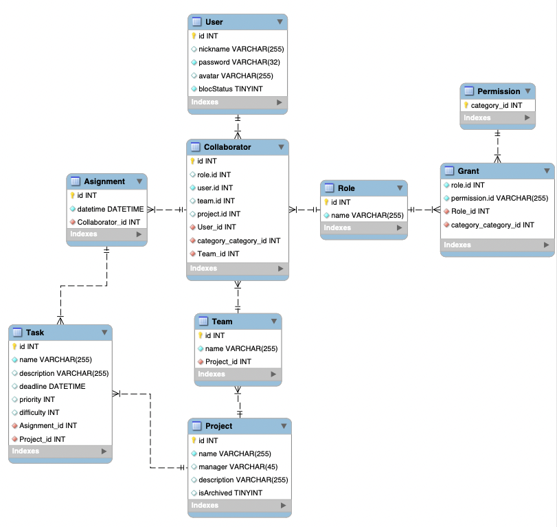

# Проєктування бази даних

## Модель бізнес-об'єктів 

@startuml

entity User

entity User.nickname
entity User.email
entity User.password
entity User.avatar
entity User.blockStatus

User.nickname -d-* User
User.email -d-* User
User.password -d-* User
User.avatar -d-* User
User.blockStatus -d-* User

entity Collaborator
Collaborator "0,*" -u- "1,1" User

entity Role

entity Role.id
entity Role.name

Role.name -d-* Role
Role.id -d-* Role

Collaborator "0,*" -r- "1,1" Role

entity Grant
Grant "0,*" -l- "1,1" Role

entity Permission

entity Permission.id

Permission.id -u-* Permission

Permission "1,1" -l-"0,*" Grant

entity Team
Collaborator "0,*" -d- "1,1" Team

entity Project

entity Project.name
entity Project.description
entity Project.manager

Project "1,1" -r- "0,*" Team
Project.name -r-* Project
Project.description -d-* Project
Project.manager -u-* Project

entity Task
entity Assignment

entity Task.name
entity Task.description
entity Task.deadline
entity Task.priority
entity Task.difficulty
entity Task.projectOwn

Task "1,1" -u- "0,*" Assignment
Task.name -u-* Task
Task.description -u-* Task
Task.deadline -u-* Task
Task.priority -u-* Task
Task.difficulty -u-* Task
Task.projectOwn -l-* Task
Collaborator "1,1" -d- "0,*" Assignment

@enduml

## ER-модель
@startuml

entity User {
  +id: INT
  +nickname: TEXT
  +email: TEXT
  +password: TEXT
  +avatar: TEXT
  +blockStatus: BOOL
}

entity Collaborator {
  +id: INT
  +collaboratorID: INT
}

entity Role {
  +id: INT
  +roleID: INT 
  +name: TEXT
}

entity Grant {
  +id: INT
  +grantID: INT
}

entity Permission {
  +id: INT
  +permissionID: INT
}

entity Team {
  +id: INT
  +teamID: INT
}

entity Project {
  +id: INT
  +projectID: INT
  +name: TEXT
  +description: TEXT
  +manager: TEXT
}

entity Task {
  +id: INT
  +taskID: INT
  +name: TEXT
  +description: TEXT
  +deadline: DATETIME
  +priority: TEXT
  +difficulty: TEXT
}

entity Assignment {
  +id: INT
  +assignmentID: INT
}

User -- Collaborator : "0,*" -- "1,1"
Collaborator -- Role : "0,*" -- "1,1"
Role -- Grant : "0,*" -- "1,1"
Grant -- Permission : "1,1" -- "0,*"
Collaborator -- Team : "0,*" -- "1,1"
Team -- Project : "0,*" -- "1,1"
Collaborator -- Assignment : "0,*" -- "1,1"
Task -- Assignment : "1,1" -- "0,*"
Task -- Project : "1,1" -- "0,*"

@enduml

## Реляційна схема

