# Тестування працездатності системи

## Старт серверу

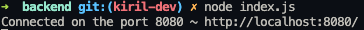

## Початкове наповнення 

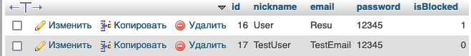

## POST

#### Запит

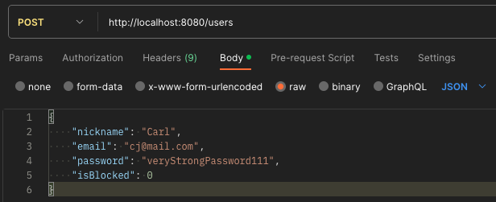

#### Відповідь серверу

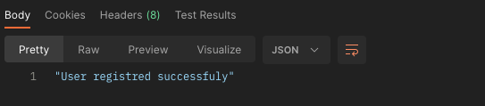

#### Результат

## GET ALL

#### Запит

#### Відповідь серверу

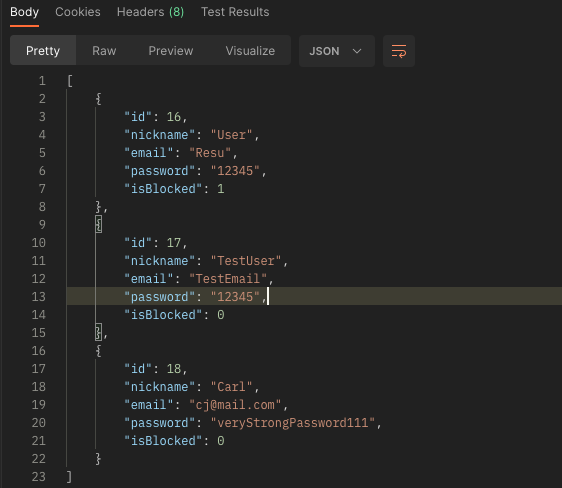

## GET BY ID

#### Запит

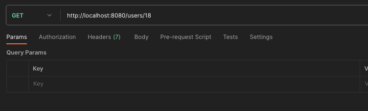

#### Відповідь серверу

## PUT

#### Запит

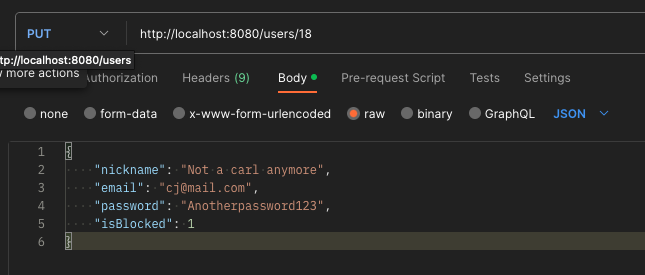

#### Відповідь серверу

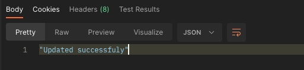

#### Результат

## DELETE

#### Запит

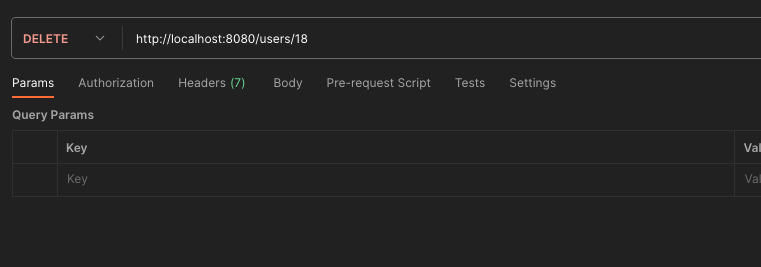

#### Відповідь серверу

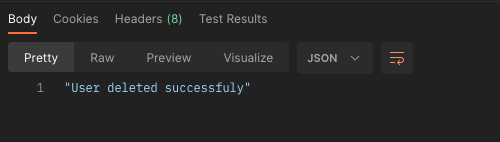

#### Результат

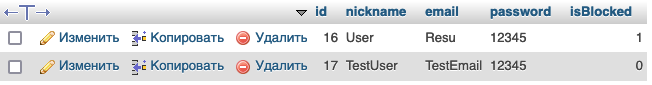

## ERROR TEST

#### Запит

#### Відповідь серверу

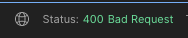
